## *Hi Everyone! I'm Ariel Fazle Mawla Bryan Adams👋*
#### I'm a Computer Systems undergraduate passionate about Networking, IoT, and Embedded Systems.

 

      

 

## 👨‍💻 About Me
I'm a Computer Systems undergraduate at Gunadarma University with a strong interest in Networking, Embedded Systems, and Internet of Things (IoT). I have built several practical and problem-solving projects, including a fire detection system with real-time email alerts, a drowsiness detection system based on eye state analysis, hand tracking applications using computer vision, and network simulations using Cisco routers.

Through my internship at PT PLN (Persero), I gained exposure to real-world systems, professional workflows, and teamwork in a technical environment.I enjoy building solutions that combine software and hardware to solve real-world problems, especially in networking and intelligent systems.

Currently, I am focused on strengthening my technical skills, expanding my project portfolio, and preparing for a career in networking, cloud computing, and IoT.

 

## 🎓 Certifications & Learning

  

  
  
  

- I’m currently working on **@Coursera**
- I’m currently learning [**Introduction to Secure Networking**  offered by Microsoft on Coursera](https://coursera.org/share/bb426b861fb24197171f90b925036adb)

 

## 🛠️ Skills

  

 

## 🚀 Featured Projects

### 🚨🔥📲 Fire Detection System (Computer Vision)

  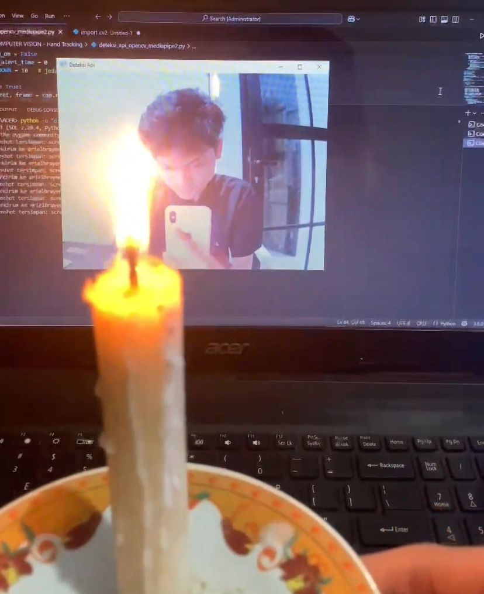
  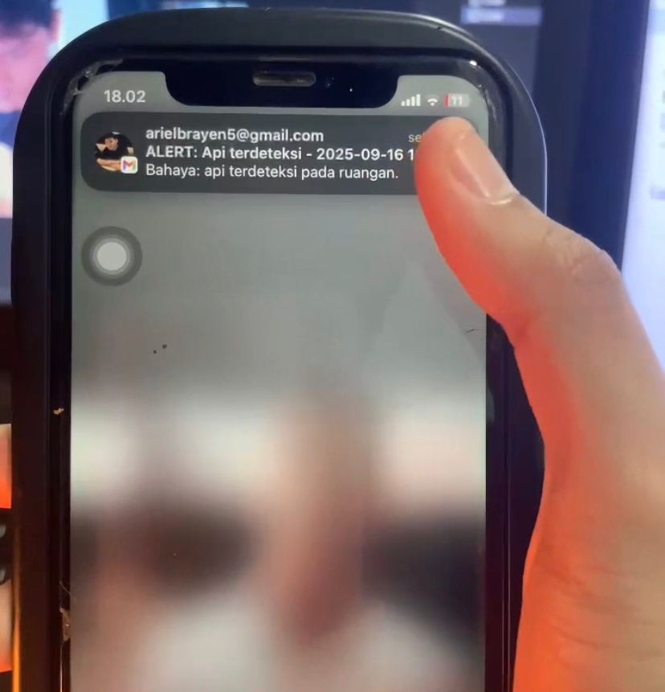

  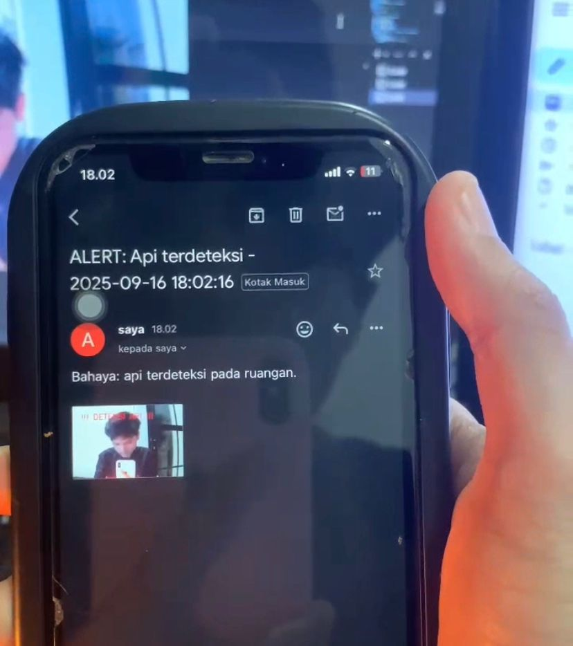
  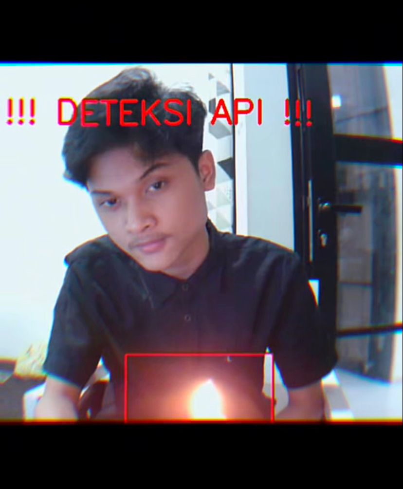

- Built using OpenCV (Python)
- Real-time fire detection using computer vision
- Activates alarm (beep sound) and displays warning message
- Captures screenshots automatically upon detection
- Sends real-time email alerts via Gmail with captured images
- System continuously monitors and stops alerts when no fire is detected
- [View Project](https://github.com/arielbryannn/Detection-Projects/blob/main/deteksi_api_opencv_mediapipe2.py)

### 😴🚨 Drowsiness Detection System (Computer Vision)

  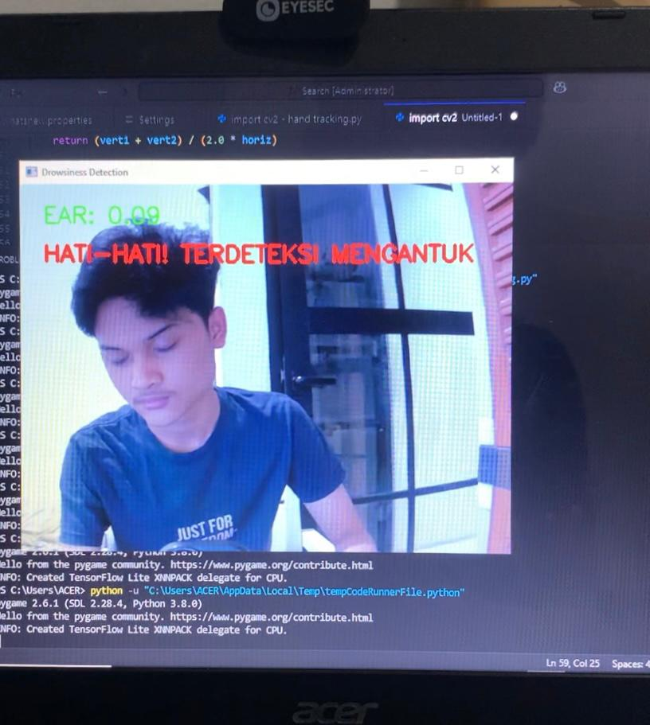

- Eye state detection (open/closed) using computer vision
- Detects drowsiness based on eye aspect ratio (EAR)
- Triggers alert when eyes remain closed beyond a certain threshold
- Helps prevent driver fatigue and microsleep
- Real-time monitoring using webcam
- [View Project](https://github.com/arielbryannn/Detection-Projects/blob/main/import%20cv2-sleep%20detected.py)

### ✋🔊 Hand Tracking Application (Computer Vision)

  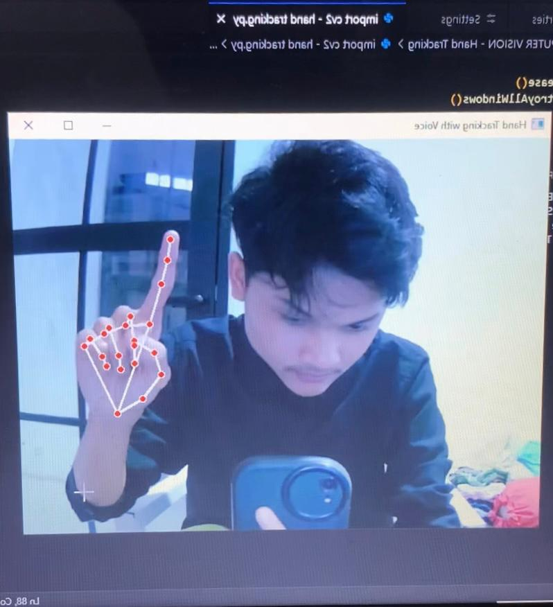

- Real-time hand gesture tracking using OpenCV
- Detects individual fingers (thumb, index, middle, ring, little)
- Each finger gesture triggers a specific voice output
- Example outputs:
  - Thumb → "Halo, perkenalkan"
  - Index → "Nama saya Ariel"
  - Middle → "Salam kenal yaa"
  - Ring → "Terima kasih"
  - Little → "Sampai jumpa"
- [View Project](https://github.com/arielbryannn/Detection-Projects/blob/main/import%20cv2%20-%20hand%20tracking2.py)

### 🐟⚙️ Automatic Fish Feeder System (Arduino Uno)

  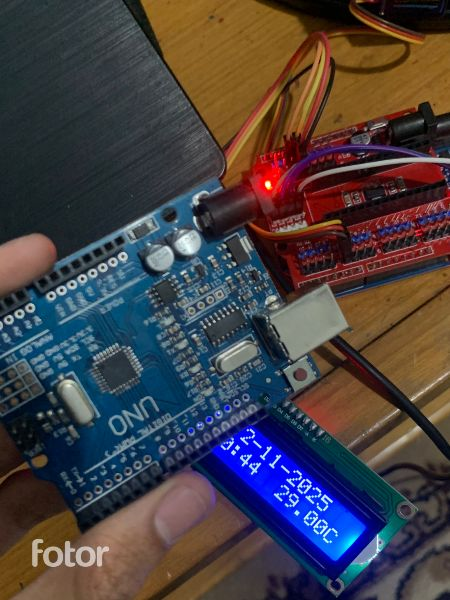
  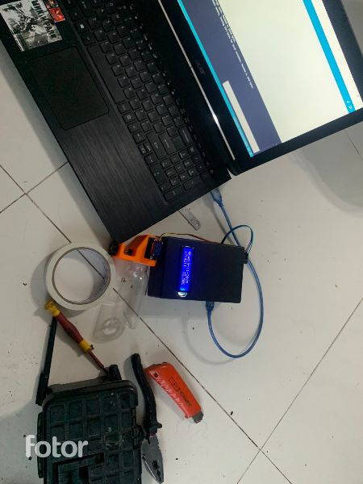

  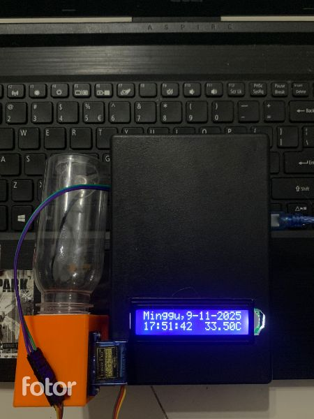
  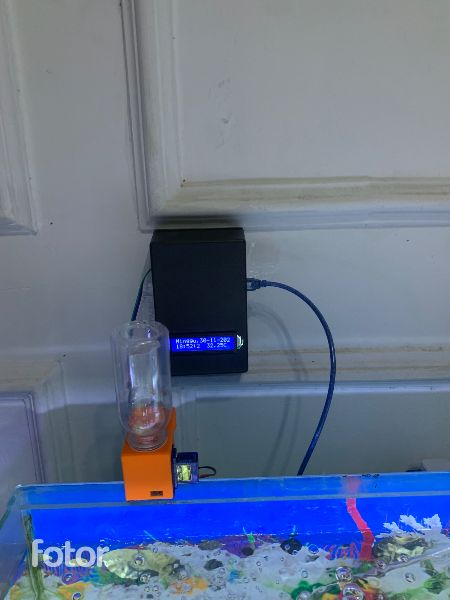

- Automated feeding based on schedule
- Uses RTC module for accurate timing
- Servo motor controls food release
- Reduces manual feeding effort
- [View Project](https://github.com/arielbryannn/Automatic_Fish_Feeder_Arduino-Project)

### 🌐🖧 Network Simulation (Cisco Packet Tracer)

  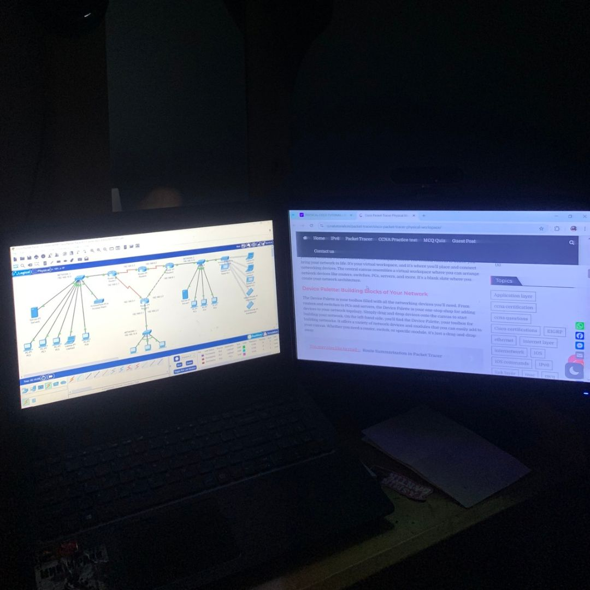
  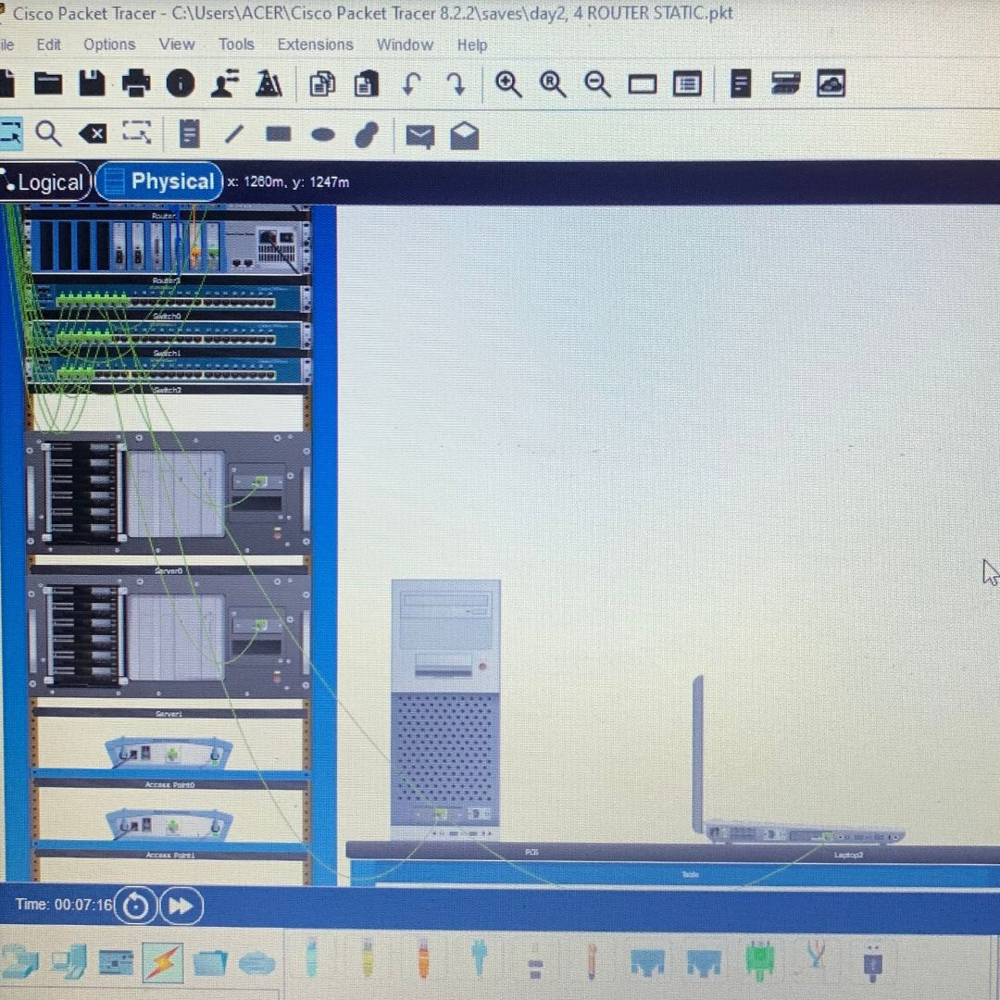

- 4 routers configured with static routing
- 2 DHCP servers for automatic IP address assignment
- Supports communication between multiple subnets
- Manual routing configuration between networks
- Simulated using Cisco Packet Tracer
- [View Project](link_github)

 

### 🤝Let's Connect With Me

  

  

  

 

 

## 📊 My GitHub Stats

 

Play games with me!

<!--
**arielbryannn/arielbryannn** is a ✨ _special_ ✨ repository because its `README.md` (this file) appears on your GitHub profile.

Here are some ideas to get you started:

- 🔭 I’m currently working on ...
- 🌱 I’m currently learning ...
- 👯 I’m looking to collaborate on ...
- 🤔 I’m looking for help with ...
- 💬 Ask me about ...
- 📫 How to reach me: ...
- 😄 Pronouns: ...
- ⚡ Fun fact: ...
-->
